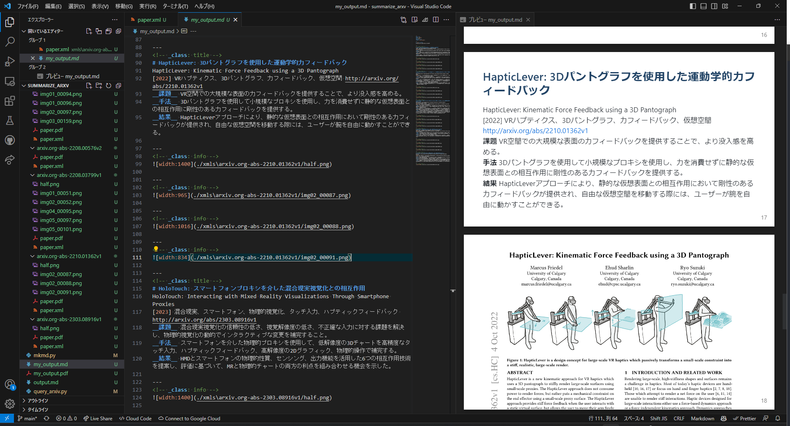

# Summarize arXiv paper with figures

arXiv の論文を検索してPDFと書誌データ、chatGPTによる要約情報をxmlファイルとして保存する`query_arxiv.py` と、保存したxmlファイル（群）から 図を抜き出して marp 形式ファイル として保存する `mkmd.py`　から成る。

## 準備

`query_arxiv.py` で OpenAI のAPIキーを設定する。
```python
openai.api_key = 'sk-....'
```

## uasge:

arXivから論文を検索、xml形式で保存し、要約を作成
```console
$ python query_arxiv.py  [-d 論文と要約を保存するフォルダのパス] [-n 要約する論文の本数] [-y 何年からの論文を見たいか(年数を入力)] "検索する単語"  
```

ダウンロードした情報からスライド(markdown)を作成(ここで選んだキーワードを含む論文をパワポ化する)
```
$ python mkmd.py [-o .mdファイルの名前（ex. my_output.md）] [-d Step.1で論文と要約を保存したフォルダのパス] "Step.1で取得した論文の中に含まれるキーワード"
```

directory はxmlファイルが保存されるディレクトリ

生成された ***.md ファイルは marp (https://marketplace.visualstudio.com/items?itemName=marp-team.marp-vscode ) に準拠しているので、　VS Codeで読み込めばスライド形式として閲覧したり、PDFファイルとして保存することができます：

## コマンド例
### Step.1
```
python query_arxiv.py  --dir ./xmls --num 10 --year 2017 "Ryo Suzuki"
```
### Step.2
```
python mkmd.py -o my_output.md -d ./xmls "3D"
```

## 生成例




